# Configuration
This page contains the detailed steps to configure the project. Major configurations include setting up the Google Sheets API, Badgr API, and Cloudflare.

## General

- `PORT`: The port on which the server will run. Default is `3000`.

## Google Sheets Configuration

Here are the detailed steps to get the required credentials:

1. Go to [Google Developers Console](https://console.cloud.google.com/).

Create a new project.

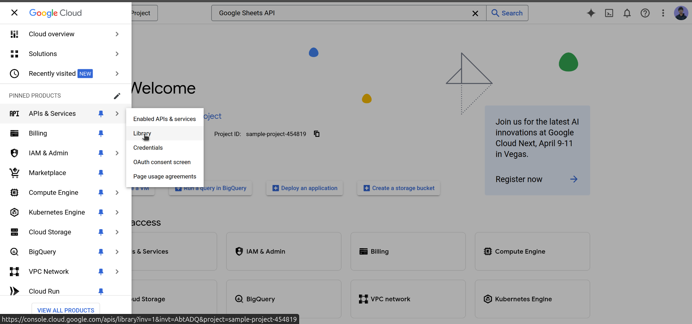

Give it a name and click on create.

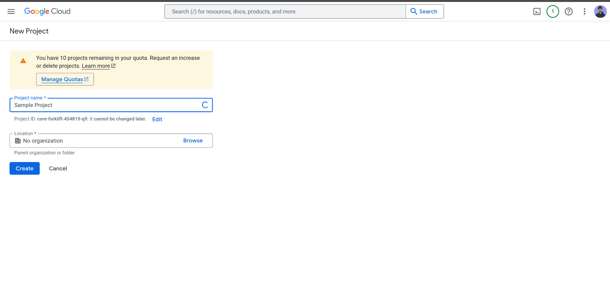

Visit the library 

Search for Google Sheets API and enable it.

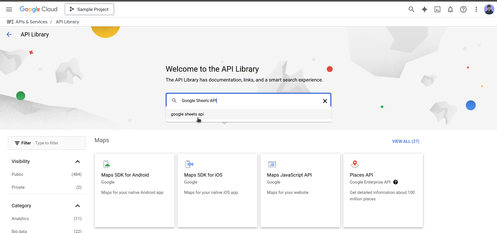

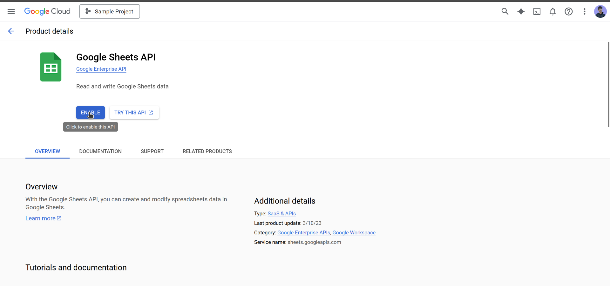

Now we need to create a service account.

Go to the credentials section.

Click on manage service accounts.
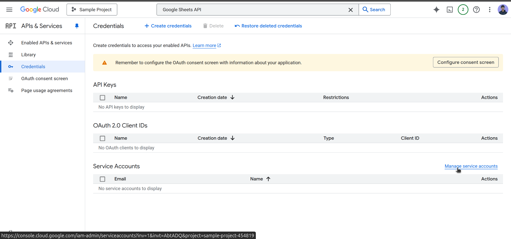

Click on create service account.

Give it a name and provide the editor role.
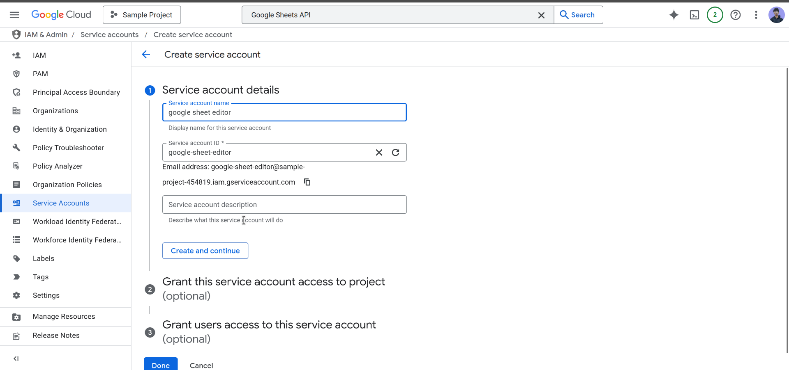

Now service account is created sucessfully. We need to generate a private key.
Click on actions and create key.
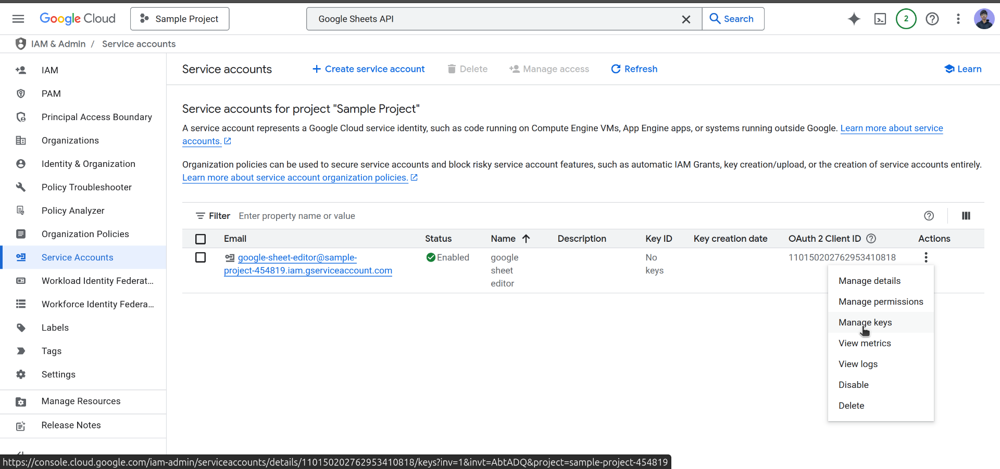

Click on add key

Select JSON and click on create.

It will download a JSON file. Open the file and copy the contents.

Now you need to replace the following values in the `.env` file:

- **GOOGLE_CLIENT_EMAIL**: The email address of the service account.
- **GOOGLE_PRIVATE_KEY**: The private key of the service account.

Now create a new google sheet and share it with the email address of the service account.

Visit this [link](https://docs.google.com/spreadsheets/u/0/)

Click on blank and create a new sheet.
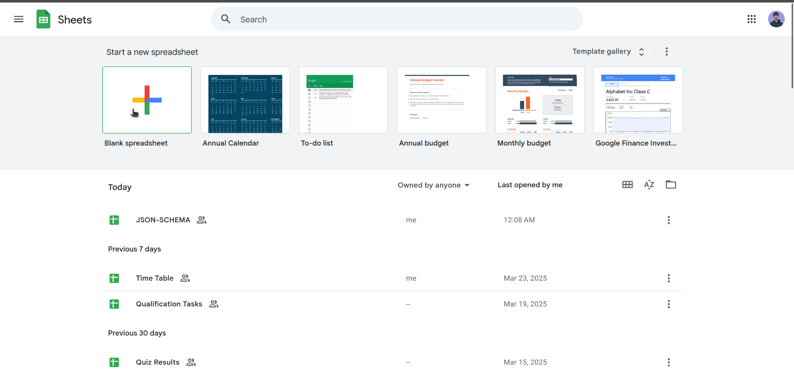

Create a proper structure of the sheet. The first row should contain the column names.
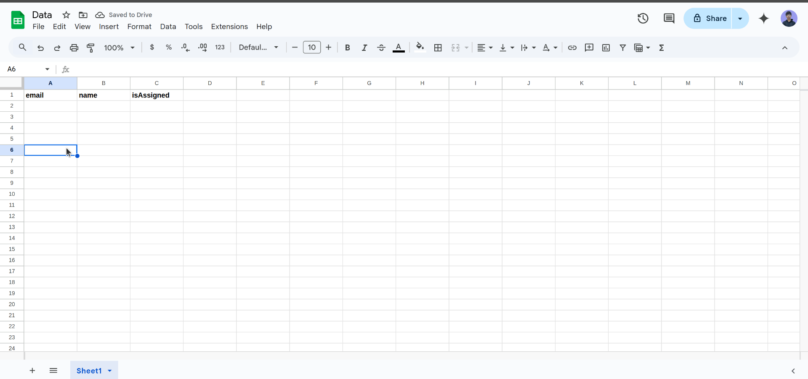

Now share the sheet with the email address of the service account as editor.

Now you can access the sheet using the google sheet API.

## Badgr API Configuration
To get the required credentials for the Badgr API, follow these steps:

1. Go to [Badgr](https://badgr.com/).
2. Sign in to your account with email and password.
3. Go to the issuer section.
4. Click on the create issuer 
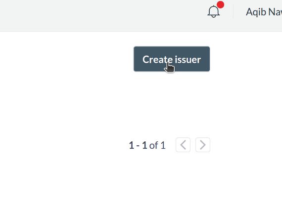
5. Provide necessary details and click on create.

Now you need to create the badge

1. Click on create badge.
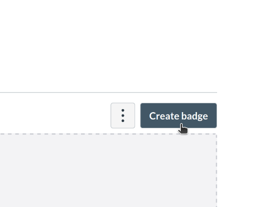
2. Provide necessary details and click on create.

Now you need to grab the credentials.

1. Go to the issuer section.
2. Click on the issuer you created.
In url you will find the issuer id.

3. Click on the badge you created.
In url you will find the badge id.

Now you need to replace the following values in the `.env` file:

- **BADGR_EMAIL**: The email address of the Badgr account.
- **BADGR_PASSWORD**: The password of the Badgr account.
- **ISSUER_ID**: The issuer id of the badge.
- **BADGE_ID**: The badge id of the badge.

## Cloudflare Configuration

visit this [link](https://dash.cloudflare.com/)
Create an account and login.
Get your CLOUDFLARE_ID from the dashboard.

These all values can be found in the downloaded JSON file