# Badge Assurance Qualification Task - README

## Overview

This project is part of the Badge Assurance Qualification Task. It ensures a structured and reliable process for handling badge-related operations.

## Prerequisites

Ensure you have the following installed before proceeding:

- **Windows or Linux**
- **Git** ([https://git-scm.com/](https://git-scm.com/))
- **Node.js (LTS version)** ([https://nodejs.org/](https://nodejs.org/))
- **Docker (Optional but recommended for deployment)** ([https://www.docker.com/](https://www.docker.com/))

## Cloning the Repository

To get the project on your local machine, run:

```sh
# Clone the repository
git clone https://github.com/AQIB-NAWAB/Qualification-Task
cd Qualification-Task
```

## Installing Dependencies

Run the following command inside the project directory:

```sh
npm install
```

This will install all required dependencies for the project.

## Configuration

Now you need to setup the configuration for the project. Run the following command:

```sh
cp .env.example .env
```

This will create a new `.env` file in the project root. Open the file and update the following values:

## General

- `PORT`: The port on which the server will run. Default is `3000`.

## Google Sheets Configuration

Here are the detailed steps to get the required credentials:

1. Go to [Google Developers Console](https://console.cloud.google.com/).

Create a new project.

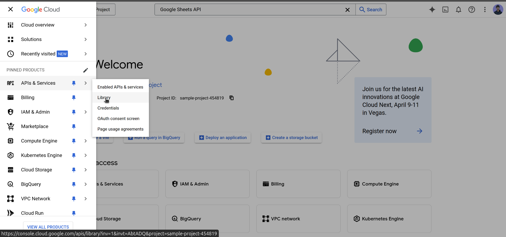

Give it a name and click on create.

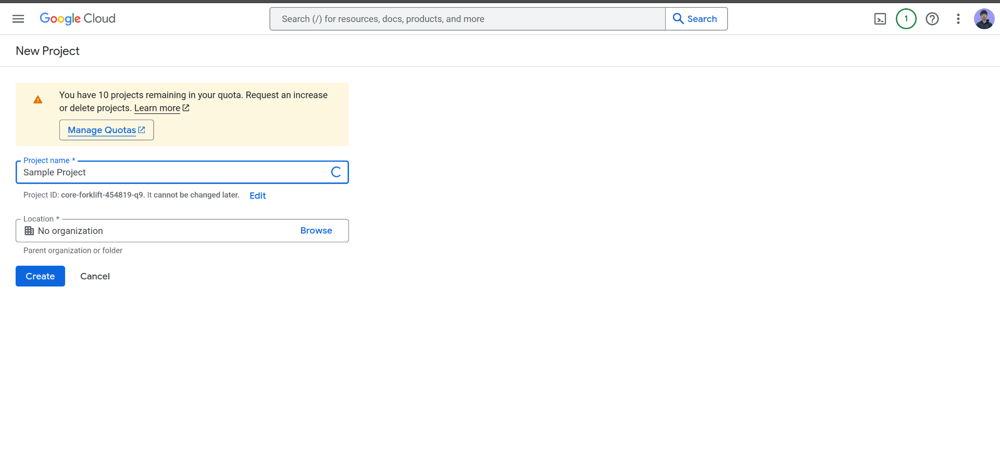

Visit the library 


Search for Google Sheets API and enable it.

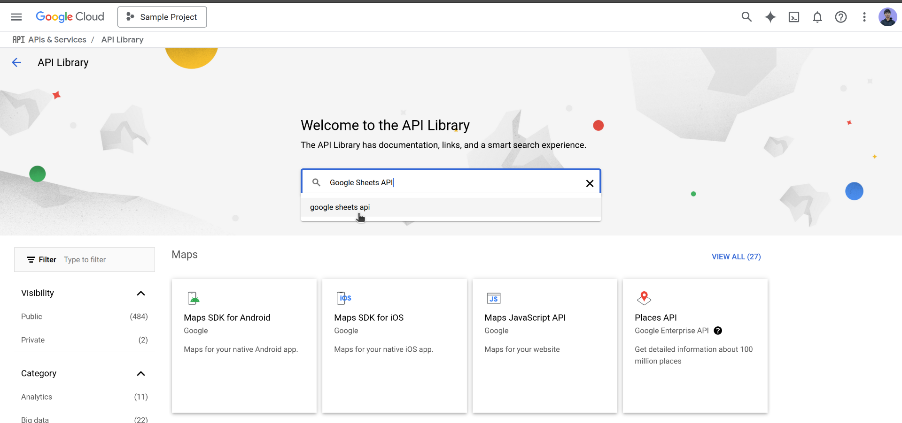

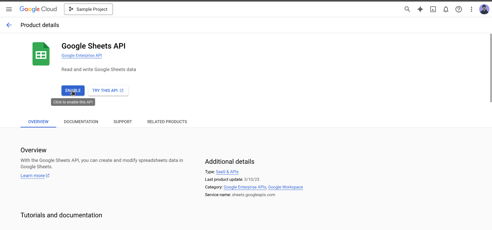

Now we need to create a service account.

Go to the credentials section.

Click on manage service accounts.
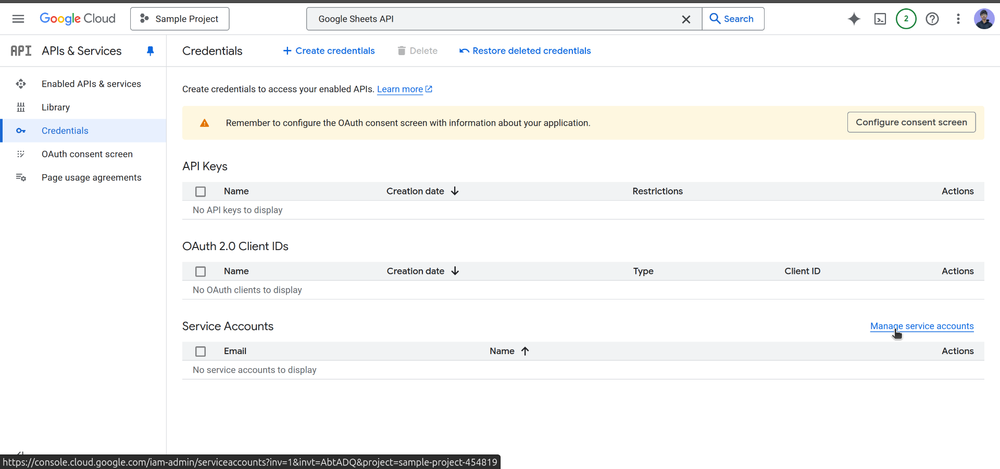

Click on create service account.
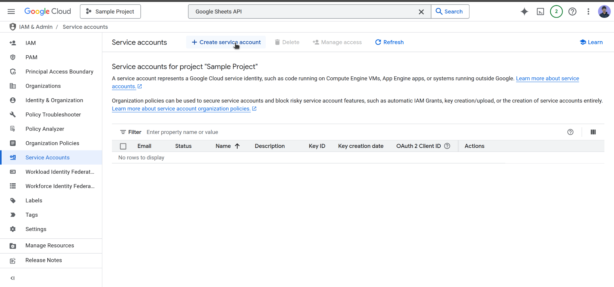

Give it a name and provide the editor role.
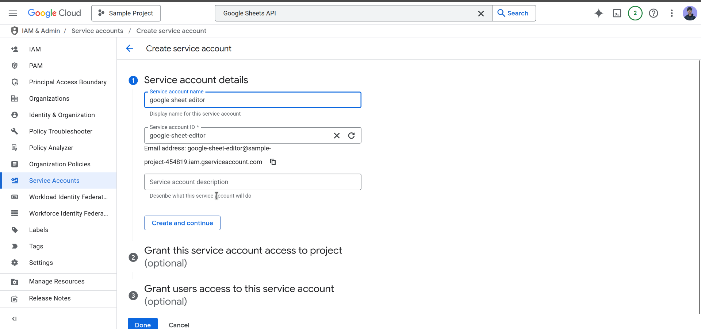
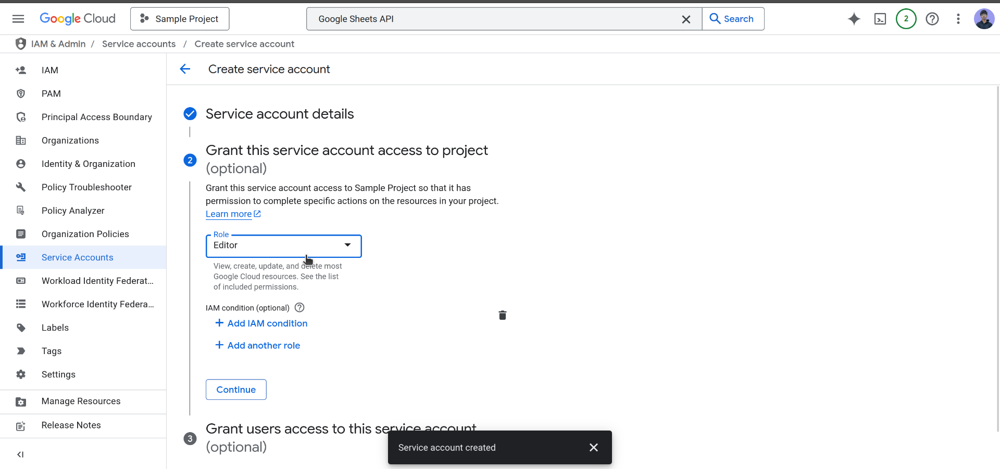

Now service account is created sucessfully. We need to generate a private key.
Click on actions and create key.
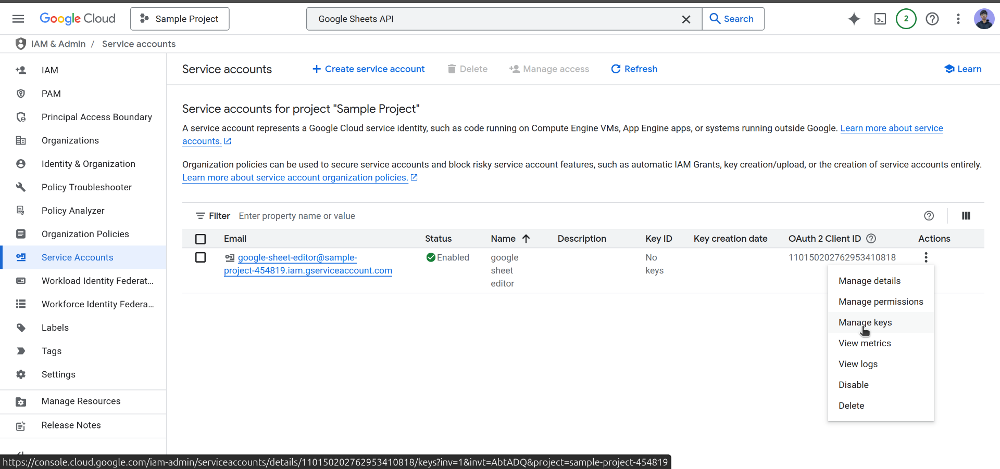

Click on add key
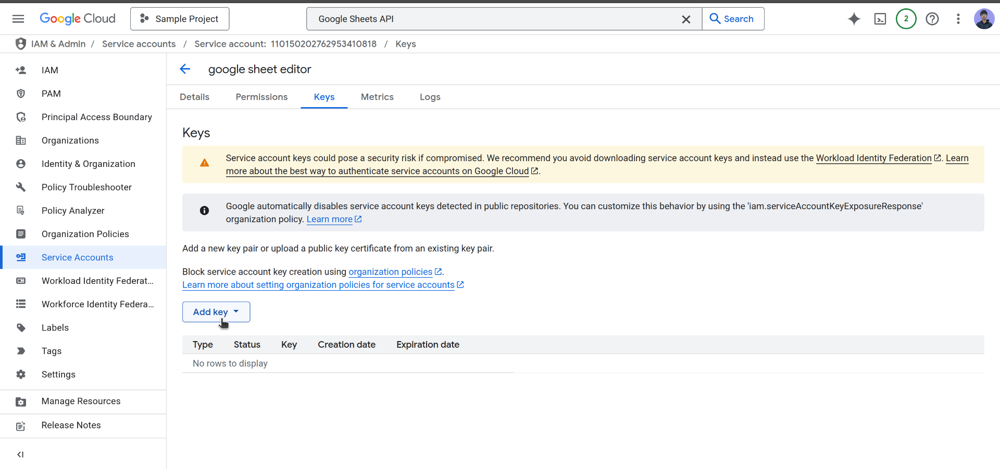

Select JSON and click on create.
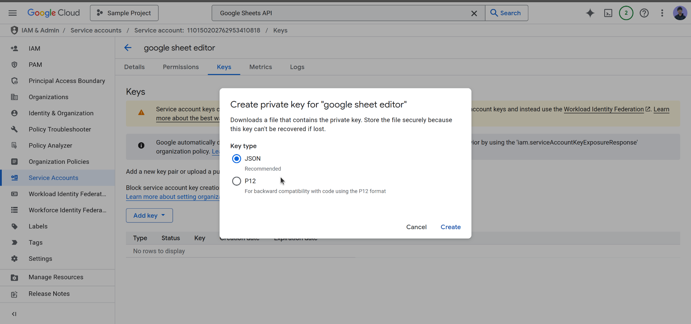

It will download a JSON file. Open the file and copy the contents.


Now you need to replace the following values in the `.env` file:

- GOOGLE_CLIENT_EMAIL: The email address of the service account.
- GOOGLE_PRIVATE_KEY: The private key of the service account.
- GOOGLE_SHEET_ID: The ID of the Google Sheet to be used.


These all values can be found in the downloaded JSON file.


## Running the Project

### On Windows (Powershell or CMD)

```sh
npm start
```

### On Linux/macOS

```sh
npm run start
```

If using Docker:

```sh
docker-compose up --build
```

## Expected Output

Once the server is running, you should see an output similar to:

```
Server is running on http://localhost:3000
Database connected successfully
```

You can visit `http://localhost:3000` to interact with the application.

## Building for Production

To create a production build, run:

```sh
npm run build
```

This will generate optimized production files.

## Troubleshooting

- If you encounter dependency issues, try running:
  ```sh
  npm audit fix --force
  ```
- If the server doesn’t start, ensure all required environment variables are set properly.

## Additional Notes

For Windows users, if facing permission issues, try running commands with **Administrator privileges**.

For any additional setup, refer to the documentation or reach out for support.

---

Happy Coding! 🚀

